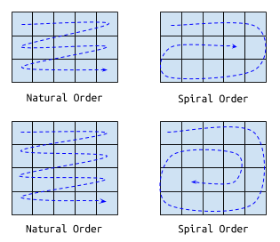

Matrix Helix Morph
===

## Overview

Given an `m x n` matrix of `int`s, implement a method that returns a new matrix with the contents that are a morphed into a helix version of the original matrix.

What we will call the "natural order" is one that involves reading a matrix row-by-row starting with the top row. The helix order keeps the first row unchanged but then the subsequent elements follow a helix, with the last element in the original matrix (the element at the bottom right) becoming the innermost element in a helix. (The figure below has two examples of the natural vs. sprial order.)

## Your Task

In the Java class `MatrixHelix`, implement the method `int[][] helix(int[][])` that returns a matrix of identical dimensions to the input matrix, but with the contents in helix order. Your implementation should account for matrices of different sizes and should handle corner cases as well (`0 x 0` matrices and `1 x 1` matrices, for example).

## Examples

The matrix

| 1   | 2   | 3   |
|:---:|:---:|:---:|
| 4    | 5    | 6    |
| 7    | 8    | 9    |

would become 

| 1    | 2    | 3    |
|:---:|:---:|:---:|
| 8    | 9    | 4    |
| 7    | 6    | 5    |

after the helix morph.

The matrix

| 7    | 5    | 1    | 4    | 6    |
|:---:|:---:|:---:|:---:|:---:|
| 3    | 2    | 9    | 1    | 8    |
| 8    | 3    | 2    | 4    | 1    |
| 10   | 11   | 15   | 19   | 14   |

would become

| 7    | 5    | 1    | 4    | 6    |
|:---:|:---:|:---:|:---:|:---:|
| 4    | 1    | 10   | 11   | 3    |
| 2    | 14   | 19   | 15   | 2    |
| 3    | 8    | 8    | 1    | 9    |

after spiralizing.

## Logistics

**Submission Instructions**

+ Submit your work to Github.
+ **Do not alter the directory/folder structure. You should retain the structure as in this repository.**
+ Do not wait until the last minute to push your work to Github.

**What Should You Implement / Guidelines**

+ You should implement all the methods that are indicated with `//MODIFY THIS METHOD` and `// ADD TESTS TO CHECK PARTITIONS`.
+ Passing the provided tests is the minimum requirement. Use the tests to identify cases that need to be handled. Passing the provided tests is *not sufficient* to infer that your implementation is complete and that you will get full credit. Additional tests will be used to evaluate your work. The provided tests are to guide you.
+ You can implement additional helper methods if you need to but you should keep these methods `private` to the appropriate classes.
+ You do not need to implement new classes.
+ You can use additional **standard** Java libraries by importing them.
+ Do not throw new exceptions unless the specification for the method permits exceptions.

## Honour Code

By submitting your work to Github you agree to the following:

+ You did not consult with any other person for the purpose of completing this activity.
+ You did not aid any other person in the class in completing their activity.
+ If you consulted any external sources, such as resources available on the World Wide Web, in completing the examination then you have cited the source. (You do not need to cite class notes or Sun/Oracle Java documentation.)
+ You are not aware of any infractions of the honour code for this examination.
